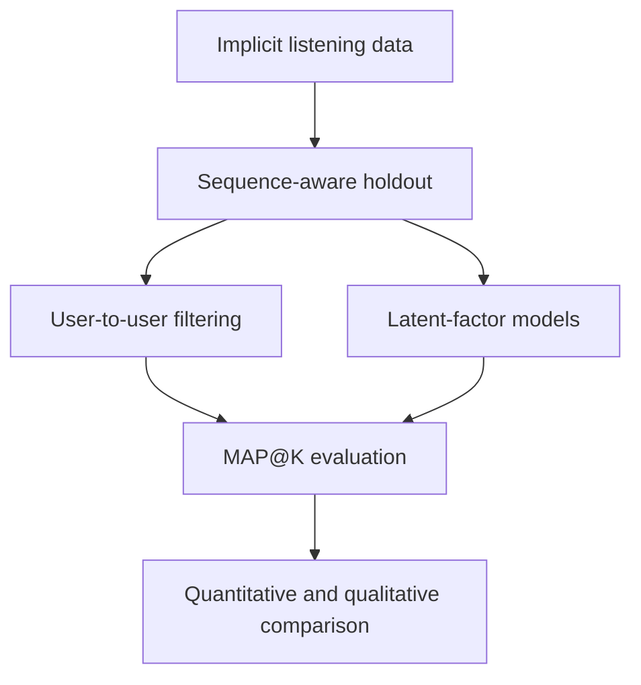

# Music Recommendation System


A recommendation-system project built from implicit music-listening data. It implements ranking metrics, user-based collaborative filtering, sparse similarity calculations, and latent-factor models from scratch, then compares them using MAP@K and qualitative recommendation examples.

[Open the complete notebook](./Music_Recommendation_System.ipynb)

## Project objective

The goal is to predict tracks that a user is likely to listen to next using only historical user–track interactions. The project investigates four practical questions:

1. Which user-similarity function produces better recommendations?
2. How does recommendation quality change with list length?
3. Can sparse calculations reproduce dense collaborative-filtering results more efficiently?
4. Do latent-factor models outperform transparent neighborhood methods?

## Dataset

The data contain implicit interactions between **241 users** and more than **65,000 encoded tracks**. A separate metadata table provides track titles and artists for qualitative analysis.

| File | Description |
|---|---|
| `data/music_dataset.csv` | User–track listening interactions |
| `data/tracks_info.csv` | Track names and artist metadata |

The notebook loads both files directly from the repository, so no manual download is required when internet access is available.

## Workflow



### 1. Evaluation protocol

The final 50 interactions of every user are reserved for testing. Tracks absent from the training catalog are removed from the holdout set because collaborative models cannot learn representations for unseen items.

Recommendation quality is measured with Mean Average Precision at K:

$$
MAP@K = \frac{1}{N}\sum_{u=1}^{N}AP_u@K
$$

MAP@K rewards models that place relevant tracks near the beginning of each recommendation list. Tracks already seen during training are removed before evaluation.

### 2. Neighborhood collaborative filtering

The project compares two binary-interaction similarities:

- **Normalized overlap**, named `pearson` in the implementation. Because the data are binary and not mean-centered, it is mathematically closer to cosine-style normalized overlap than conventional Pearson correlation.
- **Jaccard similarity**, which divides the number of shared tracks by the size of the combined listening catalog.

Users with similarity above `0.02` are treated as neighbors. Candidate tracks are scored by a similarity-weighted aggregation of neighbor interactions.

### 3. Sparse calculations

CSR-based versions of both similarity functions are implemented with SciPy. The saved dense and sparse experiments return identical recommendation arrays, confirming functional consistency. A fully scalable implementation would also keep the base interaction matrix sparse throughout the entire pipeline.

### 4. Latent-factor models

Each user and track is represented by a lower-dimensional vector, with predicted relevance calculated by their dot product:

$$
\hat r_{ui}=p_u^\top q_i
$$

Two optimization strategies are explored:

- **Stochastic Gradient Descent (SGD):** updates embeddings from observed interactions.
- **Alternating Least Squares (ALS):** alternates closed-form updates of user and track factors with L2 regularization.

The experiment uses 64 latent dimensions for ALS and 128 dimensions for SGD.

## Results

The notebook evaluates MAP@K for recommendation-list lengths from 1 to 49.

| Approach | Observed behavior |
|---|---|
| Normalized overlap | Strongest at rank 1, then declines rapidly as the list grows |
| Jaccard similarity | Best practical multi-item performance; peaks around K = 3–4 |
| Random ranking | Remains effectively at zero |
| ALS factorization | Competitive at the first rank, but weaker than Jaccard for most larger K values |
| SGD factorization | Remains close to the random baseline in the saved configuration |

### Recommended model

**Jaccard user-to-user collaborative filtering** is the strongest choice for this dataset when generating practical multi-track lists. It combines good medium-depth MAP@K, transparent recommendation logic, and a straightforward path to sparse computation.

ALS remains useful when top-rank performance or reusable track embeddings are more important than accuracy across a longer list.

## Qualitative findings

The notebook complements MAP@K with two manual inspections:

- Personalized recommendations for a sampled user are compared with previously heard and held-out tracks. Several classic pop and rock recommendations are plausible, while the diverse list also illustrates the limitations of interaction-only personalization.
- The learned ALS track space is inspected around **“Выхода нет” by Сплин**. Some neighbors—including Leonard Cohen, Nick Cave & The Bad Seeds, and related Russian-language artists—are stylistically reasonable. Repeated similarity values, however, suggest that the current embedding space has limited separation.

## Installation

Clone the repository and create an isolated Python environment:

```bash
git clone https://github.com/murodzodam01/Music-Recommendation-System.git
cd Music-Recommendation-System

python -m venv .venv
source .venv/bin/activate
python -m pip install --upgrade pip
python -m pip install numpy pandas scipy scikit-learn matplotlib seaborn tqdm jupyter
```

On Windows, activate the environment with:

```powershell
.venv\Scripts\activate
```

Start Jupyter and open the notebook:

```bash
jupyter notebook Music_Recommendation_System.ipynb
```

## Repository structure

```text
Music-Recommendation-System/
├── data/
│   ├── music_dataset.csv
│   └── tracks_info.csv
├── Music_Recommendation_System.ipynb
└── README.md
```

## Limitations

- The sparse experiment confirms matching recommendations but does not record reproducible runtime or memory measurements.
- SGD and ALS do not optimize identical implicit-feedback objectives in the stored implementation, so their comparison is exploratory.
- Model selection relies mainly on MAP@K; coverage, novelty, diversity, and popularity bias are not measured.
- The qualitative user example is randomly selected and may change between executions.
- Hyperparameters are tested selectively rather than through a dedicated validation search.

## Future improvements

- Store the interaction matrix as CSR throughout the complete workflow.
- Add popularity, item-content, and hybrid recommendation baselines.
- Use a consistent implicit-feedback objective and top-K evaluation pipeline for all factorization methods.
- Tune similarity thresholds, embedding size, regularization, learning rate, and training duration.
- Report catalog coverage, novelty, diversity, and popularity bias alongside MAP@K.
- Evaluate multiple random seeds and fixed qualitative examples for stronger reproducibility.

## Tech stack

`Python` · `pandas` · `NumPy` · `SciPy` · `scikit-learn` · `Matplotlib` · `Seaborn` · `Jupyter`

## Author

**Muhammad Murodzoda**
